# 服务器配置

@[TOC](目录)  

## 装机

### 制作u启

[下载镜像](https://next.itellyou.cn/)

[下载ultraiso](https://cn.ultraiso.net/)

文件->打开->选择镜像  


启动->  写入硬盘映像  
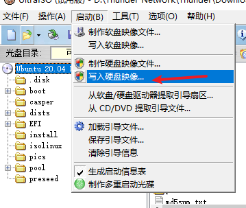

选择你的u盘，写入  
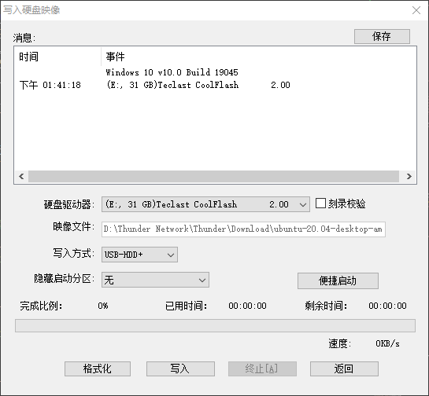

### 安装系统

重启，按f10进入bios（不同机子进入bios方式不同，比如我这里是f2/del）  
  

在boot里，把你的u盘放第一个，然后save & exit  
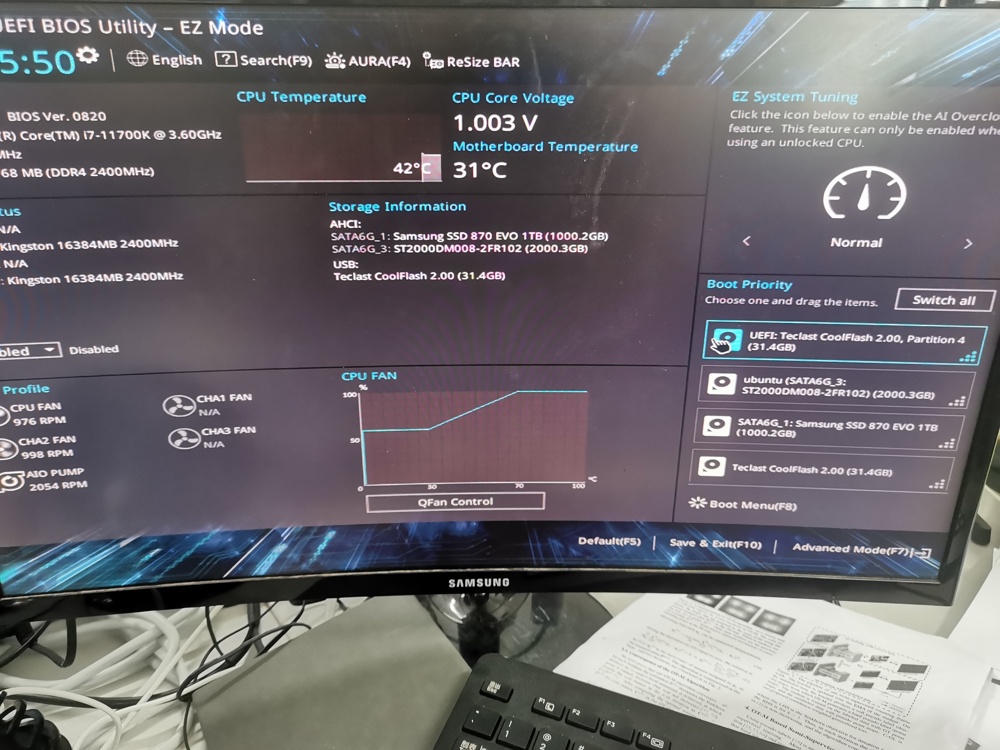  

### ubuntu

选Ubuntu（safe graphics）
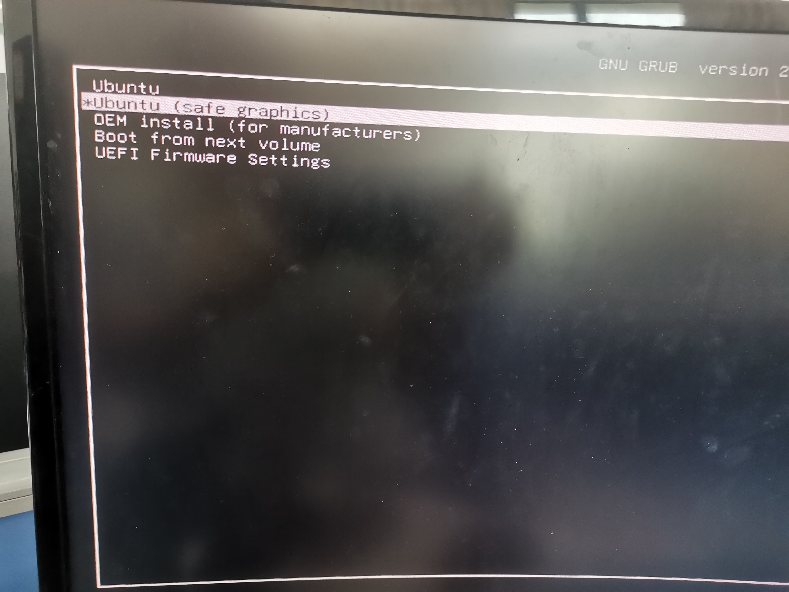  
选English，然后Install Ubuntu  
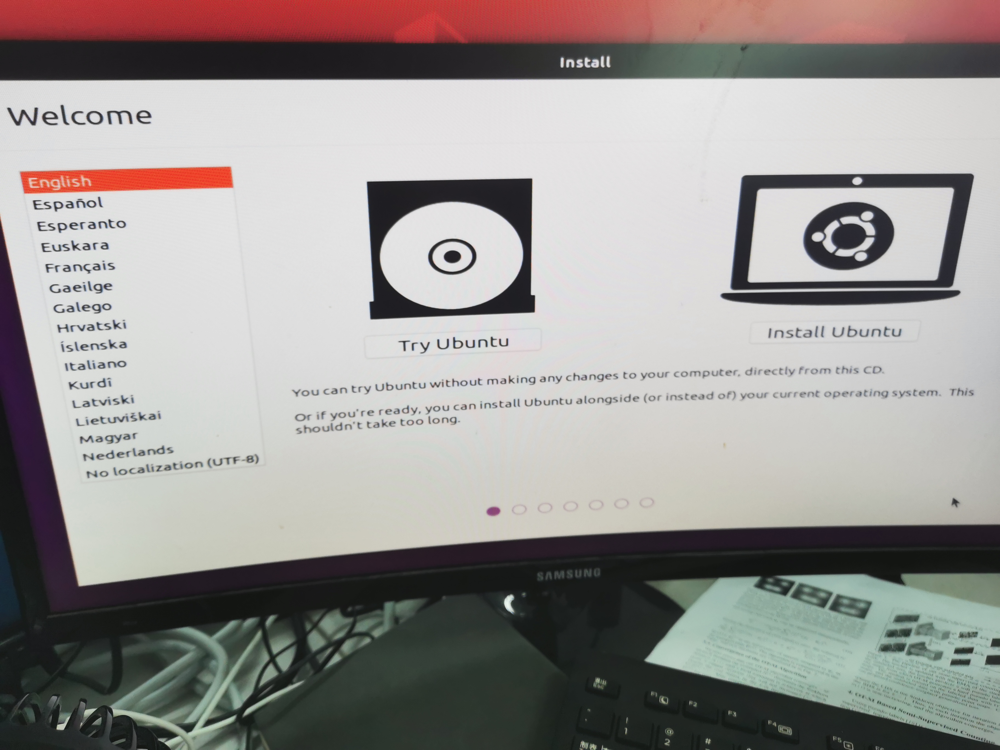  
选English，然后continue  
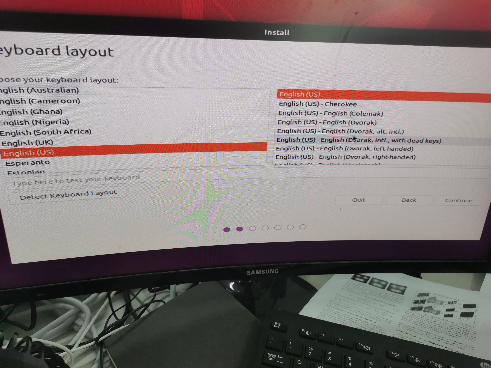  
选Minimal installation, 勾下面的install third-party  
  
选Something else  
  

通过减号，使得一个盘只剩一个free space  
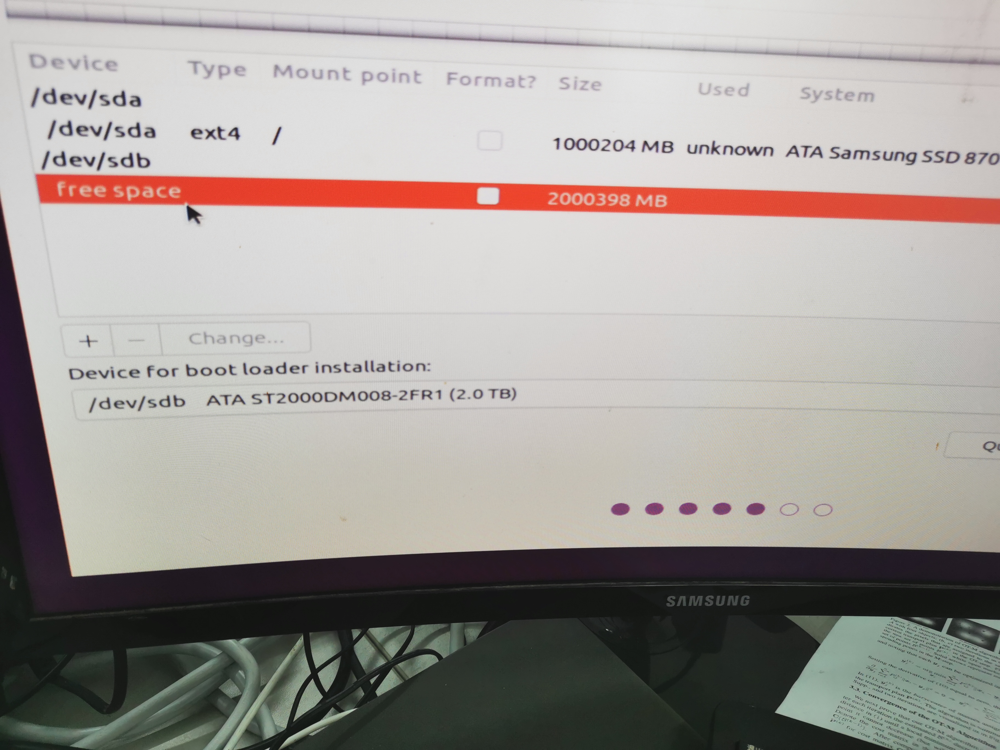  

点击加号，分配swap，一般分配2倍内存  
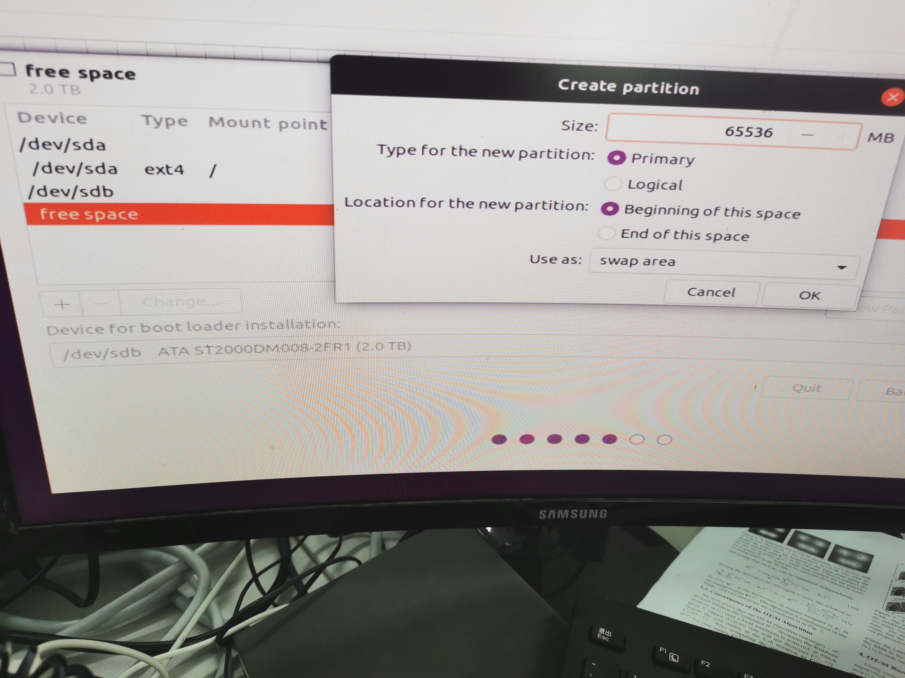
点击加号，分配efi，2g就够了  
  
点击加号，分配boot，2g就够了  
  
剩下的给root  
  
点击安装

后续步骤就一路continue就行  

最后安装好了会提示你拔了u盘，再点击重启

## ubuntu换源
  
[原blog](https://blog.csdn.net/qq_39942341/article/details/120394844?ops_request_misc=&request_id=19ce8a4d8ffe4e80834a84247b5f1158&biz_id=&utm_medium=distribute.pc_search_result.none-task-blog-2~blog~koosearch~default-10-120394844-null-null.268^v1^control&utm_term=ubuntu&spm=1018.2226.3001.4450)  

ustc：[https://mirrors.ustc.edu.cn/help/ubuntu.html](https://mirrors.ustc.edu.cn/help/ubuntu.html)

修改/etc/apt/sources.list为下面的内容  
其中，jammy表示ubuntu22，focal表示ubuntu20，bionic表示ubuntu18  
**注意修改jammy**

```bash
# 默认注释了源码仓库，如有需要可自行取消注释
deb https://mirrors.ustc.edu.cn/ubuntu/ jammy main restricted universe multiverse
# deb-src https://mirrors.ustc.edu.cn/ubuntu/ jammy main restricted universe multiverse

deb https://mirrors.ustc.edu.cn/ubuntu/ jammy-security main restricted universe multiverse
# deb-src https://mirrors.ustc.edu.cn/ubuntu/ jammy-security main restricted universe multiverse

deb https://mirrors.ustc.edu.cn/ubuntu/ jammy-updates main restricted universe multiverse
# deb-src https://mirrors.ustc.edu.cn/ubuntu/ jammy-updates main restricted universe multiverse

deb https://mirrors.ustc.edu.cn/ubuntu/ jammy-backports main restricted universe multiverse
# deb-src https://mirrors.ustc.edu.cn/ubuntu/ jammy-backports main restricted universe multiverse

# 预发布软件源，不建议启用
# deb https://mirrors.ustc.edu.cn/ubuntu/ jammy-proposed main restricted universe multiverse
# deb-src https://mirrors.ustc.edu.cn/ubuntu/ jammy-proposed main restricted universe multiverse
```

然后更新  

```bash
sudo apt update && sudo apt -y upgrade
```

## NVIDIA驱动

[nvidia驱动](https://www.nvidia.cn/Download/Find.aspx?lang=cn)

卸载原来的  
```bash
sudo apt-get update
sudo apt-get remove --purge nvidia*
 
# 如果有以前的版本，那就卸载
sudo chmod +x *.run
sudo ./NVIDIA-Linux-x86_64-384.59.run --uninstall
```

禁用nouveau驱动  

```bash
sudo nano /etc/modprobe.d/blacklist.conf
```

在最后添加

```bash
blacklist nouveau
options nouveau modeset=0
```

保存，退出  

输入

```bash
sudo update-initramfs -u
```

重启

输入

```bash
lsmod | grep nouveau
```

如果什么都没有输出，则代表禁用nouveau驱动成功

禁用X-Window服务

```bash
sudo service lightdm stop
```

安装gcc，dkms

```bash
sudo apt-get install build-essential dkms -y
```

安装驱动

```bash
sudo chmod +x NVIDIA-Linux-x86_64-410.104.run
sudo ./NVIDIA-Linux-x86_64-410.104.run -no-nouveau-check -no-opengl-files
```

如果显示32位，那不要装  
如果提出x服务，可以不装  
其他的选ok就行  

测试  

```bash
nvidia-smi
```

## cuda

[cuda](https://developer.nvidia.cn/cuda-toolkit-archive)

选择好了之后，执行红色箭头这一句，或者浏览器下载也行（不要执行后面的sh）


```bash
sudo chmod a+x cuda_11.7.1_515.65.01_linux.run
sudo ./cuda_11.7.1_515.65.01_linux.run --no-opengl-lib
```

中间把drive的勾去掉，其他默认
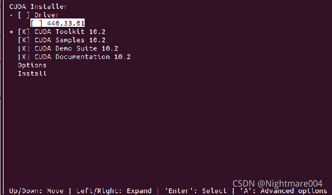

```bash
sudo nano ~/.bashrc
```

在末尾添加

```bash
export CUDA_HOME=/usr/local/cuda-11.7
export LD_LIBRARY_PATH=/usr/local/cuda-11.7/lib64:$LD_LIBRARY_PATH
export PATH=/usr/local/cuda-11.7/bin:$PATH
```

保存退出  

```bash
source ~/.bashrc
```

测试

```bash
nvcc -V
```

## cudnn

[cudnn](https://developer.nvidia.cn/rdp/cudnn-archive)  

下linux_x86_64  
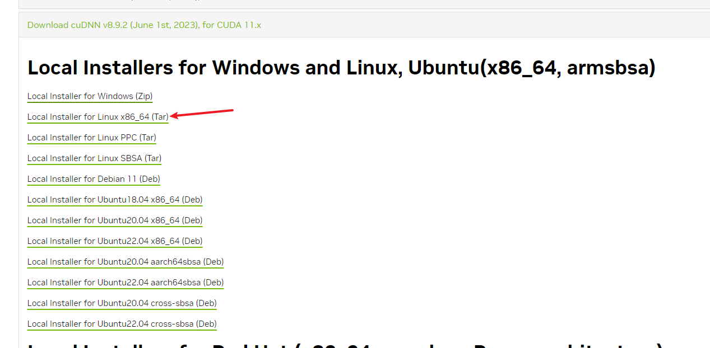

```bash
tar -zxvf cudnn-10.0-linux-x64-v7.5.0.56.tgz
 
sudo cp cuda/include/*.h /usr/local/cuda/include
sudo cp cuda/lib64/libcudnn* /usr/local/cuda/lib64
sudo chmod a+r /usr/local/cuda/include/*.h /usr/local/cuda/lib64/libcudnn*
sudo ldconfig
```

如果提示xxx is not a symbolic link  
注意修改下面的路径，分别要改cuda-11.2,so.8.1.1

```bash
sudo ln -sf /usr/local/cuda-11.2/targets/x86_64-linux/lib/libcudnn.so.8.1.1 /usr/local/cuda-11.2/targets/x86_64-linux/lib/libcudnn.so.8
sudo ln -sf /usr/local/cuda-11.2/targets/x86_64-linux/lib/libcudnn_adv_train.so.8.1.1 /usr/local/cuda-11.2/targets/x86_64-linux/lib/libcudnn_adv_train.so.8
sudo ln -sf /usr/local/cuda-11.2/targets/x86_64-linux/lib/libcudnn_ops_infer.so.8.1.1 /usr/local/cuda-11.2/targets/x86_64-linux/lib/libcudnn_ops_infer.so.8
sudo ln -sf /usr/local/cuda-11.2/targets/x86_64-linux/lib/libcudnn_cnn_train.so.8.1.1 /usr/local/cuda-11.2/targets/x86_64-linux/lib/libcudnn_cnn_train.so.8
sudo ln -sf /usr/local/cuda-11.2/targets/x86_64-linux/lib/libcudnn_adv_infer.so.8.1.1 /usr/local/cuda-11.2/targets/x86_64-linux/lib/libcudnn_adv_infer.so.8
sudo ln -sf /usr/local/cuda-11.2/targets/x86_64-linux/lib/libcudnn_ops_train.so.8.1.1 /usr/local/cuda-11.2/targets/x86_64-linux/lib/libcudnn_ops_train.so.8
sudo ln -sf /usr/local/cuda-11.2/targets/x86_64-linux/lib/libcudnn_cnn_infer.so.8.1.1 /usr/local/cuda-11.2/targets/x86_64-linux/lib/libcudnn_cnn_infer.so.8
```

## conda 换源

[原blog](https://blog.csdn.net/qq_39942341/article/details/117735489?ops_request_misc=&request_id=3fa12762ad8745f997288df1cb58ef73&biz_id=&utm_medium=distribute.pc_search_result.none-task-blog-2~blog~koosearch~default-2-117735489-null-null.268^v1^control&utm_term=conda&spm=1018.2226.3001.4450)  

```bash
conda config --set show_channel_urls yes
```

win修改C:/Users/XXX/.condarc  
linux修改~/.condarc  

直接修改  

```bash
channels:
  - defaults
show_channel_urls: true
default_channels:
  - https://mirrors.bfsu.edu.cn/anaconda/pkgs/main
  - https://mirrors.bfsu.edu.cn/anaconda/pkgs/r
  - https://mirrors.bfsu.edu.cn/anaconda/pkgs/msys2
custom_channels:
  conda-forge: https://mirrors.bfsu.edu.cn/anaconda/cloud
  msys2: https://mirrors.bfsu.edu.cn/anaconda/cloud
  bioconda: https://mirrors.bfsu.edu.cn/anaconda/cloud
  menpo: https://mirrors.bfsu.edu.cn/anaconda/cloud
  pytorch: https://mirrors.bfsu.edu.cn/anaconda/cloud
  simpleitk: https://mirrors.bfsu.edu.cn/anaconda/cloud
# (option begin
create_default_packages:
  - pip
  - setuptools
#  option end)
```

最后

```cmd
conda clean -i
```

## pip 换源

[原blog](https://blog.csdn.net/qq_39942341/article/details/117735489?ops_request_misc=&request_id=3fa12762ad8745f997288df1cb58ef73&biz_id=&utm_medium=distribute.pc_search_result.none-task-blog-2~blog~koosearch~default-2-117735489-null-null.268^v1^control&utm_term=conda&spm=1018.2226.3001.4450)  


```bash
python -m pip install --upgrade pip
pip config set global.index-url https://mirrors.bfsu.edu.cn/pypi/web/simple
```

## git dns

windows的host在C:\Windows\System32\drivers\etc\host  
linux的host在/etc/hosts

把下面这段复制到host里(windows可以考虑用vscode修改)

```bash
140.82.114.3  github.com
108.160.167.165 github.global.ssl.fastly.net
185.199.110.153 assets-cdn.github.com
```

linux下可以选择  

```bash
sudo sh -c 'sed -i "/# GitHub520 Host Start/Q" /etc/hosts && curl https://raw.hellogithub.com/hosts >> /etc/hosts'
```

接着刷新dns  
windows  

```cmd
ipconfig /flushdns
```

linux  

```bash
sudo apt install nscd
sudo systemctl restart nscd
```

## 无法访问微软商店

可以先试试把代理工具关了

如果不行
win+r, 输入inetcpl.cpl
勾上TLS 1.1,TSL1.2

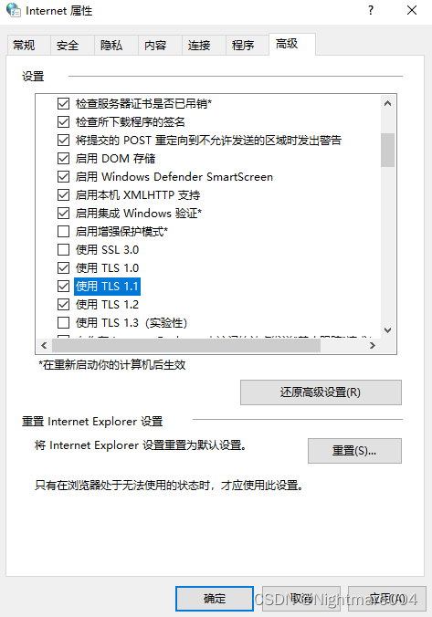

## 字体

下载下面这4个  
[MesloLGS NF Regular.ttf](
       https://github.com/romkatv/powerlevel10k-media/raw/master/MesloLGS%20NF%20Regular.ttf)  
 [MesloLGS NF Bold.ttf](
       https://github.com/romkatv/powerlevel10k-media/raw/master/MesloLGS%20NF%20Bold.ttf)  
  [MesloLGS NF Italic.ttf](
       https://github.com/romkatv/powerlevel10k-media/raw/master/MesloLGS%20NF%20Italic.ttf)  
[MesloLGS NF Bold Italic.ttf](
       https://github.com/romkatv/powerlevel10k-media/raw/master/MesloLGS%20NF%20Bold%20Italic.ttf)  

win可以直接安装  
linux  

```bash
sudo apt-get install ttf-mscorefonts-installer fontconfig -y
```

```bash
sudo mkdir -p /usr/share/fonts/MesloLGS
sudo cp *.ttf /usr/share/fonts/MesloLGS
sudo chmod -R 777 /usr/share/fonts/MesloLGS

sudo fc-cache -fv
```

## terminal

在微软商店


### 添加conda

打开windows terminal  
设置里  
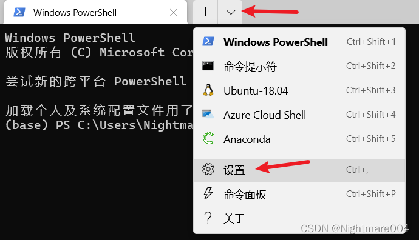  
添加新配置文件->新建空配置文件  

名称：Anaconda
命令行

```cmd
%windir%\System32\cmd.exe "/K" D:\Miniconda3\Scripts\activate.bat D:\Miniconda3
```

可以从这里抄
  
  
图标  

```bash
D:\Miniconda3\Lib\site-packages\conda\shell\conda_icon.ico
```

保存
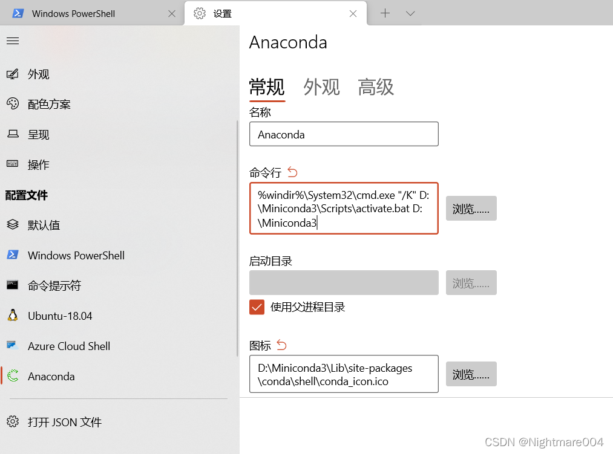

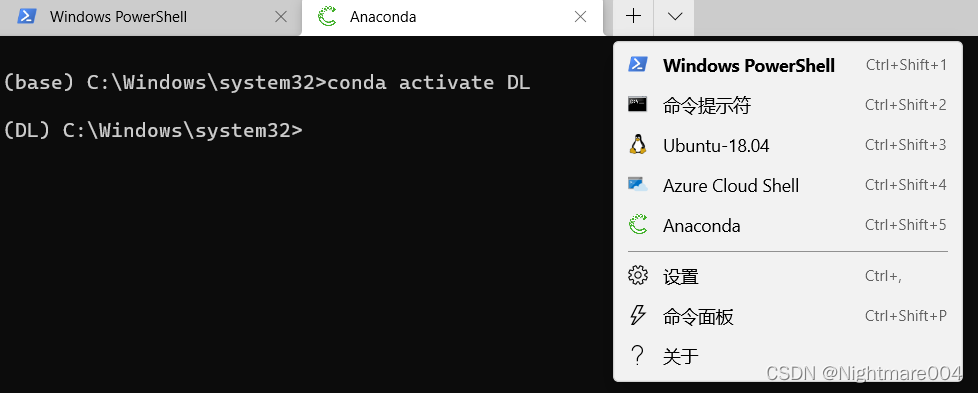

### 添加git

打开安装包（不用卸载之前的）  
其他的默认就行  
  
重新打开windows terminal  
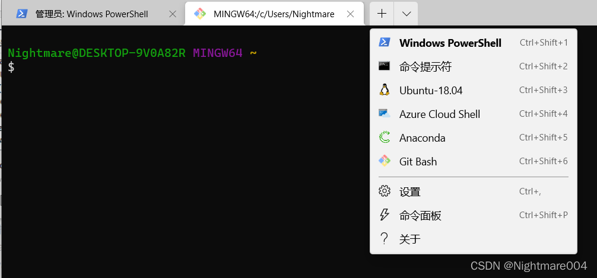  
如果没有也可以手动配置  
  

### 修改字体

建议改成MesloLGS NF


## zsh

[原blog](https://blog.csdn.net/qq_39942341/article/details/121450642?ops_request_misc=&request_id=f201544c0b6b48a2b087b076a02b10e9&biz_id=&utm_medium=distribute.pc_search_result.none-task-blog-2~blog~koosearch~default-2-121450642-null-null.268^v1^control&utm_term=zsh&spm=1018.2226.3001.4450)

### 修改字体

点终端的preferences  
  
修改字体  
  

### 安装

```bash
sudo apt-get install -y zsh git-core
```

```bash
git clone https://github.com/ohmyzsh/ohmyzsh.git ~/.oh-my-zsh
cd ~/.oh-my-zsh
zsh oh-my-zsh.sh
chsh -s `which zsh`
```

重启  

打开终端  
选择0  
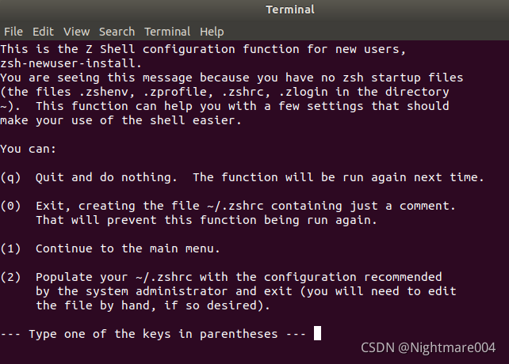

```bash
cp ~/.zshrc ~/.zshrc.orig
cp ~/.oh-my-zsh/templates/zshrc.zsh-template ~/.zshrc
chsh -s $(which zsh)
```

然后  

```bash
source ~/.zshrc
```

不过zsh和平常的环境有一点差别，具体的可以看下面

#### conda

如果你有配置conda，可能会发现没有前面的(base)了  

前面是conda所在的路径，记得修改

```bash
~/miniconda3/bin/conda init zsh
source ~/.zshrc
```

设置更新时间  

```bash
sudo nano ~/.zshrc
```

这里根据提示，然后去掉注释

保存，退出
然后

```bash
source ~/.zshrc
```

#### cuda

如果你装了cuda  
可以从~/.bashrc中复制这3句到 ~/.zshrc  
  
保存，退出  
然后  

```bash
source ~/.zshrc
```

#### powerlevel10k主题

```bash
git clone --depth=1 https://github.com/romkatv/powerlevel10k.git ${ZSH_CUSTOM:-$HOME/.oh-my-zsh/custom}/themes/powerlevel10k
sudo nano ~/.zshrc
```

修改

```bash
ZSH_THEME="powerlevel10k/powerlevel10k" 
```

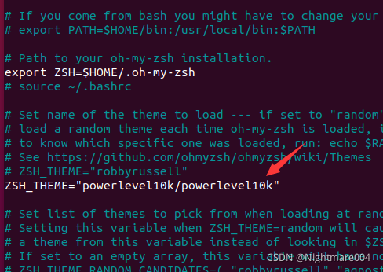
保存，退出  
然后

```bash
source ~/.zshrc
```

然后会叫你设置主题，可以根据自己的喜好设置  

设置完了以后想改，可以用这个命令重新设置  

```bash
p10k configure
```

#### 其余插件

分别是自动补全，语法高亮，补全conda

```bash
git clone https://github.com/zsh-users/zsh-autosuggestions ${ZSH_CUSTOM:-~/.oh-my-zsh/custom}/plugins/zsh-autosuggestions
git clone https://github.com/zsh-users/zsh-syntax-highlighting.git ${ZSH_CUSTOM:-~/.oh-my-zsh/custom}/plugins/zsh-syntax-highlighting
```

```bash
sudo nano ~/.zshrc
```

改这  
把zsh-syntax-highlighting添加上去  
  
保存，退出  
然后  

#### 手动更新

```bash
omz update
```

## tmux

[原blog](https://blog.csdn.net/qq_39942341/article/details/121450642?ops_request_misc=&request_id=f201544c0b6b48a2b087b076a02b10e9&biz_id=&utm_medium=distribute.pc_search_result.none-task-blog-2~blog~koosearch~default-2-121450642-null-null.268^v1^control&utm_term=zsh&spm=1018.2226.3001.4450)

```bash
sudo apt-get install -y tmux
```

```bash
cd ~
git clone https://github.com/gpakosz/.tmux.git
ln -s -f .tmux/.tmux.conf
cp .tmux/.tmux.conf.local .
```

### 常用命令

令```<prefix>```表示```ctrl```+```a```或者```ctrl```+```b```  
```<prefix> c```表示```ctrl```+```a```或者```ctrl```+```b```，然后按```c```  
```<prefix> C-c```表示```ctrl```+```a```或者```ctrl```+```b```，然后按```ctrl```+```c```  

#### 会话

创建一个名为session_name的会话  

```bash
tmux new -s session_name
```

列出所有会话  

```bash
tmux ls
```

进入已经创建好的名为session_name的会话  

```bash
tmux attach -t session_name
```

销毁会话  

```bash
tmux kill-session -t session_name
```

#### panes

起到一个终端中，分屏的作用

```<prefix> -```垂直划分pane  
```<prefix> _```水平划分pane  
```<prefix> arrow```切换pane，arrow表示方向键  
```<prefix> m```开/关鼠标模式  
```C-d```关闭pane，当最后一个没了的话，就会关闭整个会话  
```<prefix> :```进入命令模式（类似vim），输入detach可以退出会话，但是不关闭  
```<prefix> C-arrow```改变pane大小，arrow表示方向键  
鼠标模式下，直接拖动边框也可以改变pane大小  

效果  


#### windows

一个session中可以有多个windows，相当于win的桌面1，桌面2...  

```<prefix> c```创建window
```<prefix> n```跳转第n个window
```<prefix> &```退出当前window, 也可以输入exit
```<prefix> :```，输入```move-window -t session_name```可以将当前window移动到session_name里

更多命令参考：
[tmux2: Productive Mouse-Free Development]([D:\Download\dokumen.pub_tmux-2-productive-mouse-free-development-1nbsped-9781680502213.pdf](https://dokumen.pub/download/tmux-2-productive-mouse-free-development-1nbsped-9781680502213.html?reader=1))

#### 输出历史命令

```<prefix> :```，输入```capture-pane -S -3000```，其中3000表示3000行
接着，```<prefix> :```，输入```save-buffer filename```,命令就会存储到filename里

## ssh

如果没有ifconfig  

```bash
sudo apt-get install net-tools
```

然后  

```bash
ifconfig
```

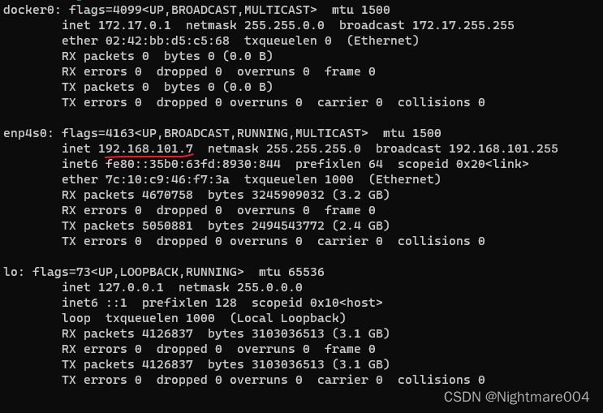

```bash
sudo apt-get install -y openssh-client openssh-server
```

设置开机启动  

```bash
sudo systemctl enable ssh
```

修改配置

```bash
sudo nano /etc/ssh/sshd_config
```

添加一行  

```bash
PermitRootLogin yes
```

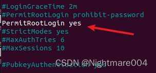  

```bash
sudo systemctl restart ssh
```

本地远程

```bash
ssh username@remote_ip_address
```

### 免密登录

按照上面的步骤会发现每次都需要输入密码，这里通过生成密钥来解决  

在本地生成密钥  
可以考虑用git bash  

```bash
ssh-keygen -t rsa
# ⽣成 id_rsa 和 id_rsa.pub, 并且⼀般存储在 ~/.ssh/下
ssh-keygen -b 4096 -t rsa
# 这个则是更安全的版本
```

第一个：key存储位置  
第二个：私钥密码，默认无密码，如果设置了私钥密码，在进行免密登录时需要输入私钥密码  
第三个：再输入一遍私钥密码  

我这里是全默认  
  

```bash
ssh-copy-id username@remote_ip_address
```


如果有权限问题，可以考虑执行下面这个  

```bash
sudo chmod 700 .ssh
sudo chmod 600 .ssh/authorized_keys
```

### vscode

安装插件  
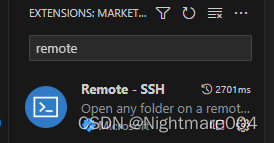  
点击左侧远程，然后ssh的设置  
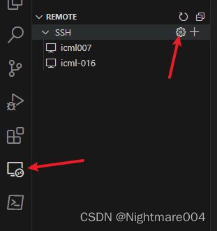  
接着选user下的  
  
接着配置  

```bash
Host 任意名字
    HostName 远程ip
    User 远程用户名
```

我这里配了2个  
  
刷新一下  
  
连接  
  
选择项目  
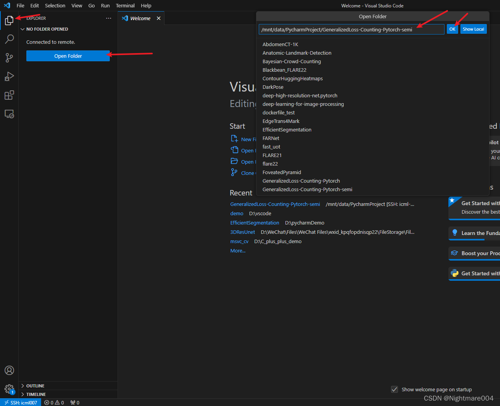  
这个选则相信  
  
之后这里修改，远程也会改  

## tensorboard

```bash
tensorboard --logdir="xxx" --host remote_ip
```

  
然后在本地输入最后显示的网址就能访问了  
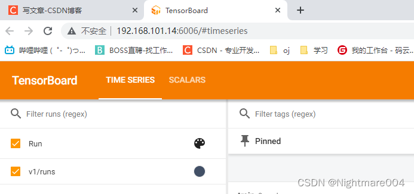  

## 文件复制

```bash
rsync -av -r --exclude preTraModel --exclude wandb --exclude workspace  ../xmuda_mink_Contrast_DDP_DM  user8@10.24.80.68:/data3/user8/xmuda_series


rsync -av -r --exclude preTraModel --exclude wandb --exclude workspace  ../GeneralizedLoss-Counting-Pytorch-semi  另一台服务器用户名@另一台服务器IP地址:/另一台服务器存储地址
```

## gpu状态

```bash
pip install gpustat
```

可以用这个命令来查看gpu状态

```bash
watch -c -n1 gpustat -cpu --force-color -P
```

为了方便，也可以起别名

```bash
alias watch='watch -c -n1 gpustat -cpu --force-color -P'
alias cls='clear'
```

## autojump

```bash
git clone git://github.com/wting/autojump.git ~/autojump
cd ~/autojump
python install.py
```

关闭terminal，然后在开一个

### zsh

```bash
nano ~/.zshrc
```

plugins中添加autojump

然后在下面额外加一句

```bash
[[ -s ~/.autojump/etc/profile.d/autojump.sh ]] && . ~/.autojump/etc/profile.d/autojump.sh
```


保存，退出

```bash
source ~/.zshrc
```

## vim

```bash
sudo apt-get install vim -y
```

配置

```bash
vim ~/.vimrc
```

输⼊下列参数，保存即可，默认C语⾔代码可以按control+p补全关键字

```bash
syntax on
set number
set cindent
set smartindent
set showmatch
set ruler
:set mouse=a
```

## jupyter

```bash
pip install jupyter
```

设置密码  

```bash
jupyter notebook password
```

文件在~/.jupyter/jupyter_server_config.json

生成配置文件  

```bash
jupyter notebook --generate-config --allow-root
```

修改生成的配置文件

```python
c.ServerApp.allow_root = True
c.ServerApp.ip = '*'
c.ServerApp.password = 'xxxx'
c.ServerApp.port = 8888
c.ServerApp.notebook_dir = ''
c.ServerApp.open_browser = False
c.ServerApp.disable_check_xsrf = True
c.ServerApp.allow_origin = '*'
```

保存

启动

```bash
jupyter notebook --allow-root
```

### 插件

TODO：装了之后暂时不能远程

安装

```bash
conda install nb_conda
conda install -c conda-forge jupyter_contrib_nbextensions
# pip install jupyter_contrib_nbextensions
```

第一次会显示这样的页面

需要把终端中提示的token输进来，然后自己设置一个密码

下一次登入就可以直接输密码了

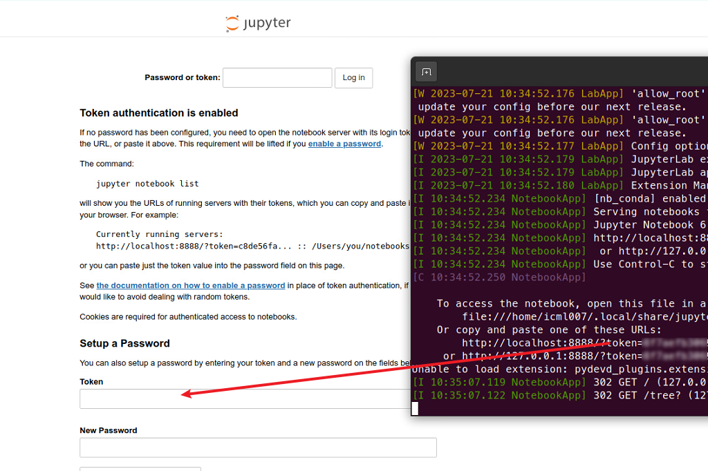

## frpc

还没研究过

从 github 将 linux_amd64 结尾的 tar.gz ⽤ wget 下载下来  
然后解压  
从别处拷⻉ .ini ⽂件  

```ini
[common]
server_addr = xx.xx.xx.xx (这个是服务器的 IP)
server_port = 7000 (这个是服务器脚本的端⼝)
[ssh*](这⾥的*改成对应的编号, ⽐如 ssh1 ssh2 ssh3)
type = tcp
local_ip = 127.0.0.1
local_port = 22
remote_port = 只需要改这个端⼝就可以, ⽐如 6001 6002 6003
```

```bash
sudo nano /etc/systemd/system/frpc.service
```

```ini
[Unit]
Description=frpc daemon
After=syslog.target network.target
Wants=network.target
[Service]
Type=simple
ExecStart=/home/sxl/Downloads/frp_0.27.0_linux_amd64/frpc -c /home/sxl/Downloads/frp_0.27.0_linux_amd64/frpc.ini
Restart= always
RestartSec=1min
[Install]
WantedBy=multi-user.target
```

```bash
systemctl start frpc # 启动frps
systemctl enable frpc # frps设置为开机启动
```

## 设置定时重启

```bash
sudo crontab -e
# 编辑内容如下, 为每天 4 点重启
0 4 * * * /sbin/reboot
sudo service cron restart
```

## wandb

TODO

## docker

TODO

## 好用的工具

- snipaste (在微软商城)
- 剪切板（win+v）
- notion
- Grammarly
- QuillBot
- Semantic Scholar
- Connected Papers
